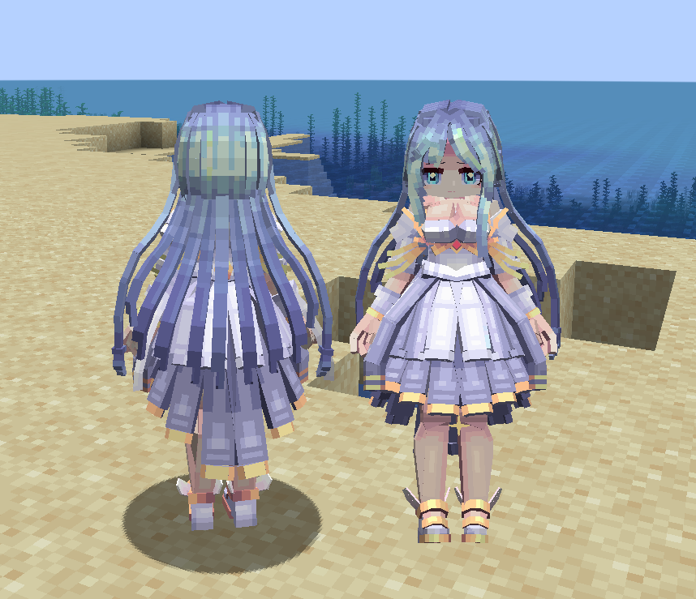
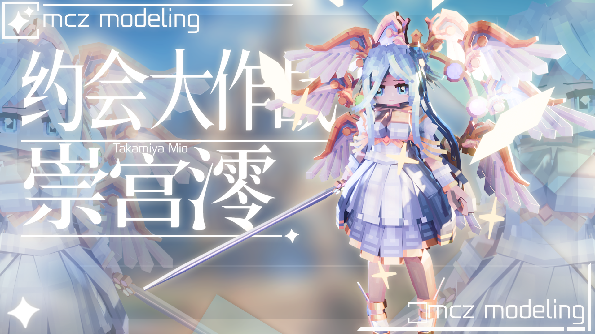

# DAL_崇宫澪_Takamiya-Mio_LA

## Model Info

Expand/Collapse

<!-- GENERATED MODEL PREVIEW README START -->

<!-- GENERATED MODEL PREVIEW README END -->

- **Name**: #崇宫澪 | #Takamiya-Mio
- **Category**: #Anime
  - **Game**: #DAL #Date A Live #约会大作战

## Download

Expand/Collapse

- [DAL_崇宫澪_Takamiya-Mio.ysm (490.6 KB)](https://raw.githubusercontent.com/nekohalawrence/YSM-Model-Author/main/0112-%E5%A4%A7%E8%8E%AB%E5%AE%B6%2CMCZ%E5%B7%A5%E4%BD%9C%E5%AE%A4%2Cmcz%E8%8E%AB%E8%8E%AB%2C%E7%8A%9F%E7%8C%AB/DAL_%E5%B4%87%E5%AE%AB%E6%BE%AA_Takamiya-Mio_LA/DAL_%E5%B4%87%E5%AE%AB%E6%BE%AA_Takamiya-Mio.ysm)
- [DAL_崇宫澪_Takamiya-Mio.zip (9.7 MB)](https://raw.githubusercontent.com/nekohalawrence/YSM-Model-Author/main/0112-%E5%A4%A7%E8%8E%AB%E5%AE%B6%2CMCZ%E5%B7%A5%E4%BD%9C%E5%AE%A4%2Cmcz%E8%8E%AB%E8%8E%AB%2C%E7%8A%9F%E7%8C%AB/DAL_%E5%B4%87%E5%AE%AB%E6%BE%AA_Takamiya-Mio_LA/DAL_%E5%B4%87%E5%AE%AB%E6%BE%AA_Takamiya-Mio.zip)
- [DAL_崇宫澪_Takamiya-Mio_1.ysm (619.0 KB)](https://raw.githubusercontent.com/nekohalawrence/YSM-Model-Author/main/0112-%E5%A4%A7%E8%8E%AB%E5%AE%B6%2CMCZ%E5%B7%A5%E4%BD%9C%E5%AE%A4%2Cmcz%E8%8E%AB%E8%8E%AB%2C%E7%8A%9F%E7%8C%AB/DAL_%E5%B4%87%E5%AE%AB%E6%BE%AA_Takamiya-Mio_LA/DAL_%E5%B4%87%E5%AE%AB%E6%BE%AA_Takamiya-Mio_1.ysm)

## Author Info

Expand/Collapse

## Author

- **Name**: #大莫家 | #MCZ工作室 | #mcz莫莫 | #犟猫
  - **Author ID**: `0112`
  - **Role**: #模型 #动作 #动画 | #Model #Motion #Animation
  - **SocialPlatform**: #Bilibili #QQ
    - **Bilibili**: https://space.bilibili.com/385797854
    - **QQ**: 167941105 已满
  - **SupportPlatform**: #Afdian
    - **Afdian**: https://afdian.com/a/mcz_8888

- **Name**: #犟猫
  - **Role**: #模型 | #Model

