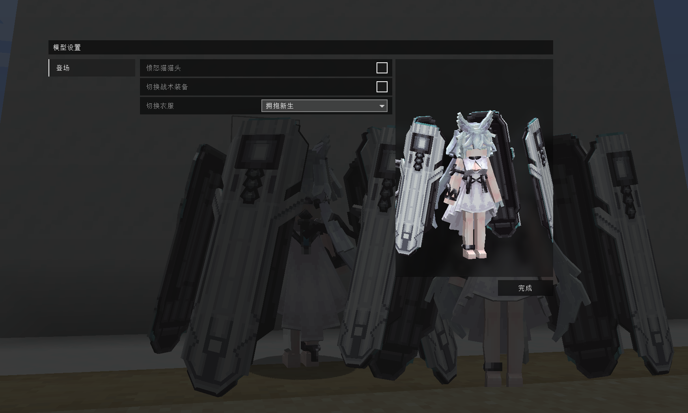

# AK_迷迭香_Rosmontis_LB

## Model Info

Expand/Collapse

<!-- GENERATED MODEL PREVIEW README START -->

<!-- GENERATED MODEL PREVIEW README END -->

- **Name**: #迷迭香 | #Rosmontis
- **Category**: #Game
  - **Game**: #AK #Arknights #明日方舟

## Download

Expand/Collapse

- [AK_迷迭香_Rosmontis_v3.0.ysm (1.8 MB)](https://raw.githubusercontent.com/nekohalawrence/YSM-Model-Author/main/0113-%E7%A7%8B%E9%A3%8E%2C%E6%AF%8F%E5%A4%A9%E9%83%BD%E7%9D%A1%E4%B8%8D%E9%86%92%E7%9A%84%E7%A7%8B%E9%A3%8E%2C%E7%9D%A1%E4%B8%8D%E6%AD%BB%E6%AD%BB%E4%B8%8D%E7%9D%A1%E7%9A%84%E7%A7%8B%E9%A3%8E/AK_%E8%BF%B7%E8%BF%AD%E9%A6%99_Rosmontis_LB/AK_%E8%BF%B7%E8%BF%AD%E9%A6%99_Rosmontis_v3.0.ysm)
- [AK_迷迭香_Rosmontis_v4.2.1.ysm (2.0 MB)](https://raw.githubusercontent.com/nekohalawrence/YSM-Model-Author/main/0113-%E7%A7%8B%E9%A3%8E%2C%E6%AF%8F%E5%A4%A9%E9%83%BD%E7%9D%A1%E4%B8%8D%E9%86%92%E7%9A%84%E7%A7%8B%E9%A3%8E%2C%E7%9D%A1%E4%B8%8D%E6%AD%BB%E6%AD%BB%E4%B8%8D%E7%9D%A1%E7%9A%84%E7%A7%8B%E9%A3%8E/AK_%E8%BF%B7%E8%BF%AD%E9%A6%99_Rosmontis_LB/AK_%E8%BF%B7%E8%BF%AD%E9%A6%99_Rosmontis_v4.2.1.ysm)

## Author Info

Expand/Collapse

## Author

- **Name**: #秋风 | #每天都睡不醒的秋风 | #睡不死死不睡的秋风
  - **Author ID**: `0113`
  - **Role**: #模型 | #Model
  - **SocialPlatform**: #Bilibili
    - **Bilibili**: https://space.bilibili.com/375227559
  - **SupportPlatform**: #Afdian
    - **Afdian**: https://afdian.com/a/qf0224

## Co-creator

- **Name**: 尼摩
  - **Role**: #赞助
  - **SocialPlatform**: #Bilibili
    - **Bilibili**: https://space.bilibili.com/352018612
  - **SupportPlatform**: #Afdian
    - **Afdian**: https://afdian.net/a/nemo_angel

