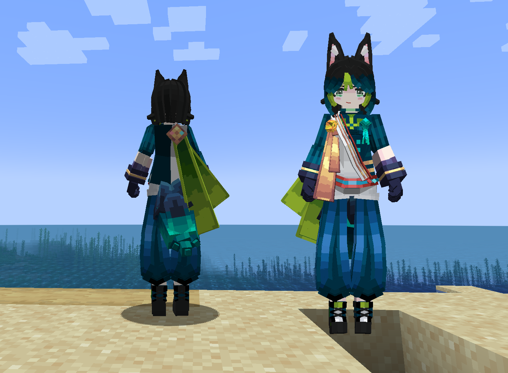
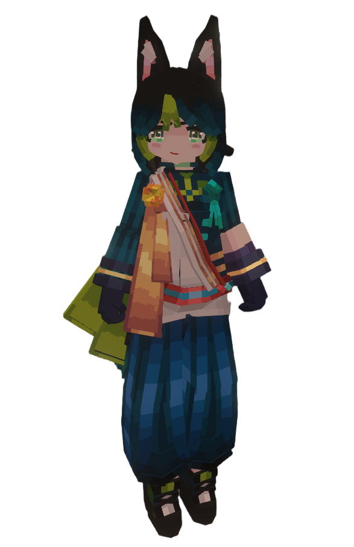

# GI_提纳里_LB

## Model Info

Expand/Collapse

<!-- GENERATED MODEL PREVIEW README START -->

<!-- GENERATED MODEL PREVIEW README END -->

- **Name**: #提纳里 | #Tighnari
- **Category**: #Game
  - **Game**: #GI #Genshin Impact #原神

## Download

Expand/Collapse

- [GI_提纳里.ysm (143.1 KB)](https://raw.githubusercontent.com/nekohalawrence/YSM-Model-Author/main/0117-%E8%81%9A%E6%A8%A1%E9%81%93%2C%E8%81%9A%E6%A0%B8%E9%87%8D%E5%B7%A5Minecraft%2C%E8%AF%AD%E6%96%87%E5%96%B5%E5%96%B5%E6%8B%B3/GI_%E6%8F%90%E7%BA%B3%E9%87%8C_LB/GI_%E6%8F%90%E7%BA%B3%E9%87%8C.ysm)

## Author Info

Expand/Collapse

## Author

- **Name**: #聚模道 | #聚核重工Minecraft | #语文喵喵拳
  - **Author ID**: `0117`
  - **Role**: #模型 #动作 #动画 | #Model #Motion #Animation
  - **SocialPlatform**: #Bilibili
    - **Bilibili**: https://space.bilibili.com/450162369
  - **SupportPlatform**: #Afdian
    - **Afdian**: https://afdian.com/a/yr9964332

