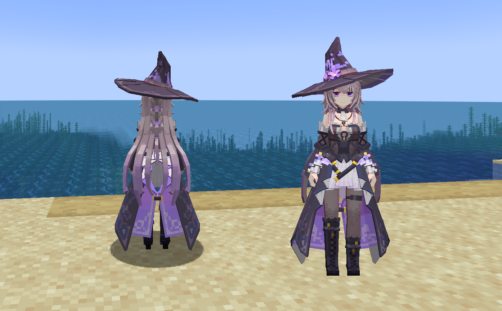

# HSR_Herta_黑塔_大_LB

## Model Info

Expand/Collapse

<!-- GENERATED MODEL PREVIEW README START -->

<!-- GENERATED MODEL PREVIEW README END -->

- **Name**: #黑塔 | #Herta
- **Category**: #Game
  - **Game**: #HSR #Honkai-Star-Rail #崩坏：星穹铁道

## Download

Expand/Collapse

- [HSR_大黑塔_Heita.ysm (466.1 KB)](https://raw.githubusercontent.com/nekohalawrence/YSM-Model-Author/main/0137-Maks%2CMaks%E6%80%9C%E6%82%AF/HSR_Herta_%E9%BB%91%E5%A1%94_%E5%A4%A7_LB/HSR_%E5%A4%A7%E9%BB%91%E5%A1%94_Heita.ysm)

## Author Info

Expand/Collapse

## Author

- **Name**: #Maks | #Maks怜悯
  - **Author ID**: `0137`
  - **Role**: #模型 #动作 #动画 | #Model #Motion #Animation
  - **SocialPlatform**: #Bilibili #QQ
    - **Bilibili**: https://space.bilibili.com/352177387
    - **QQ**: 1047117247

