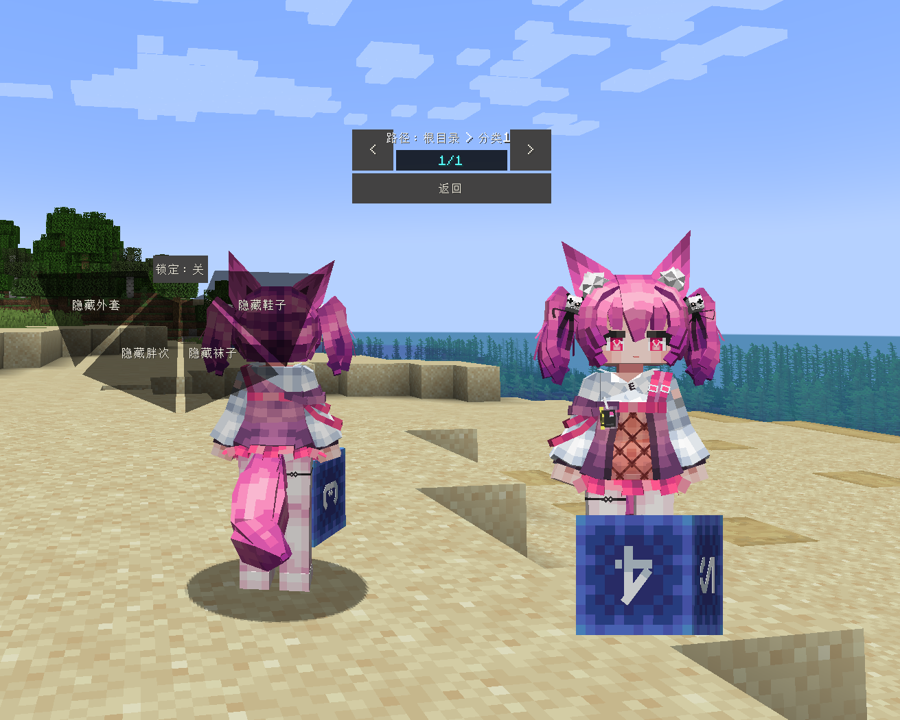
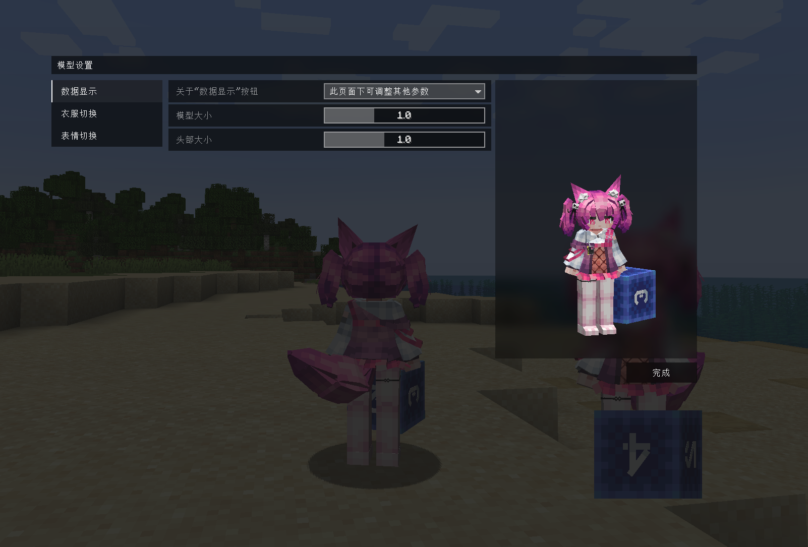

# AK_巫恋_Shamare-Witchfeast

## Model Info

Expand/Collapse

<!-- GENERATED MODEL PREVIEW README START -->

<!-- GENERATED MODEL PREVIEW README END -->

- **Name**: #巫恋 | #Shamare-Witchfeast
- **Category**: #Game
  - **Game**: #AK #Arknights #明日方舟

## Download

Expand/Collapse

- [AK_巫恋_Shamare-Witchfeast.ysm (506.2 KB)](https://raw.githubusercontent.com/nekohalawrence/YSM-Model-Author/main/0141-%E6%98%A0%E7%99%BDL%2C%E6%98%A0%E7%99%BD/AK_%E5%B7%AB%E6%81%8B_Shamare-Witchfeast/AK_%E5%B7%AB%E6%81%8B_Shamare-Witchfeast.ysm)
- [AK_巫恋_Shamare-Witchfeast_v2025.07.20.ysm (503.4 KB)](https://raw.githubusercontent.com/nekohalawrence/YSM-Model-Author/main/0141-%E6%98%A0%E7%99%BDL%2C%E6%98%A0%E7%99%BD/AK_%E5%B7%AB%E6%81%8B_Shamare-Witchfeast/AK_%E5%B7%AB%E6%81%8B_Shamare-Witchfeast_v2025.07.20.ysm)

## Author Info

Expand/Collapse

## Author

- **Name**: #映白L | #映白
  - **Author ID**: `0141`
  - **Role**: #作者
  - **SocialPlatform**: #Bilibili
    - **Bilibili**: https://space.bilibili.com/10208258
  - **SupportPlatform**: #Afdian
    - **Afdian**: https://afdian.com/a/ehaku

