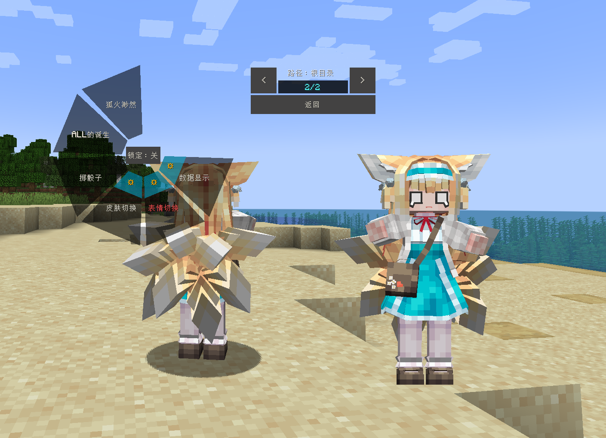

# AK_铃兰_Suzuran_LB

## Model Info

Expand/Collapse

<!-- GENERATED MODEL PREVIEW README START -->

<!-- GENERATED MODEL PREVIEW README END -->

- **Name**: #铃兰 | #Suzuran
- **Category**: #Game
  - **Game**: #AK #Arknights #明日方舟

## Download

Expand/Collapse

- [AK_铃兰_Suzuran.ysm (158.8 KB)](https://raw.githubusercontent.com/nekohalawrence/YSM-Model-Author/main/0141-%E6%98%A0%E7%99%BDL%2C%E6%98%A0%E7%99%BD/AK_%E9%93%83%E5%85%B0_Suzuran_LB/AK_%E9%93%83%E5%85%B0_Suzuran.ysm)
- [AK_铃兰_Suzuran_1.ysm (737.2 KB)](https://raw.githubusercontent.com/nekohalawrence/YSM-Model-Author/main/0141-%E6%98%A0%E7%99%BDL%2C%E6%98%A0%E7%99%BD/AK_%E9%93%83%E5%85%B0_Suzuran_LB/AK_%E9%93%83%E5%85%B0_Suzuran_1.ysm)
- [AK_铃兰_Suzuran_v2025.07.20.ysm (737.3 KB)](https://raw.githubusercontent.com/nekohalawrence/YSM-Model-Author/main/0141-%E6%98%A0%E7%99%BDL%2C%E6%98%A0%E7%99%BD/AK_%E9%93%83%E5%85%B0_Suzuran_LB/AK_%E9%93%83%E5%85%B0_Suzuran_v2025.07.20.ysm)

## Author Info

Expand/Collapse

## Author

- **Name**: #映白L | #映白
  - **Author ID**: `0141`
  - **Role**: #模型 #动作 #动画 | #Model #Motion #Animation
  - **SocialPlatform**: #Bilibili
    - **Bilibili**: https://space.bilibili.com/10208258
  - **SupportPlatform**: #Afdian
    - **Afdian**: https://afdian.com/a/ehaku

