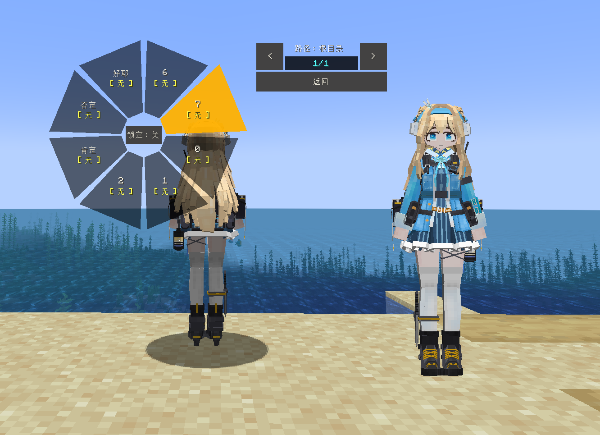

# GF_索米_Kp31_Suomi

## Model Info

Expand/Collapse

<!-- GENERATED MODEL PREVIEW README START -->

<!-- GENERATED MODEL PREVIEW README END -->

- **Name**: #KP31-Kp31
- **Category**: #Game
  - **Game**: #GF #Girls' Frontline #少女前线

## Download

Expand/Collapse

- [GF_索米_Kp31_Suomi.ysm (593.9 KB)](https://raw.githubusercontent.com/nekohalawrence/YSM-Model-Author/main/0145-%E5%92%95%E5%92%95%E9%B8%A1%2C%E5%92%95%E5%92%95%E5%8F%AB%E7%9A%84%E5%B0%8F%E8%8F%9C%E9%B8%A1/GF_%E7%B4%A2%E7%B1%B3_Kp31_Suomi/GF_%E7%B4%A2%E7%B1%B3_Kp31_Suomi.ysm)

## Author Info

Expand/Collapse

## Author

- **Name**: #咕咕鸡 | #咕咕叫的小菜鸡
  - **Author ID**: `0145`
  - **Role**: #模型 #()_ () | #Model
  - **SocialPlatform**: #Bilibili
    - **Bilibili**: https://space.bilibili.com/11989730
  - **SupportPlatform**: #Afdian
    - **Afdian**: https://afdian.com/a/GuGuChicken

