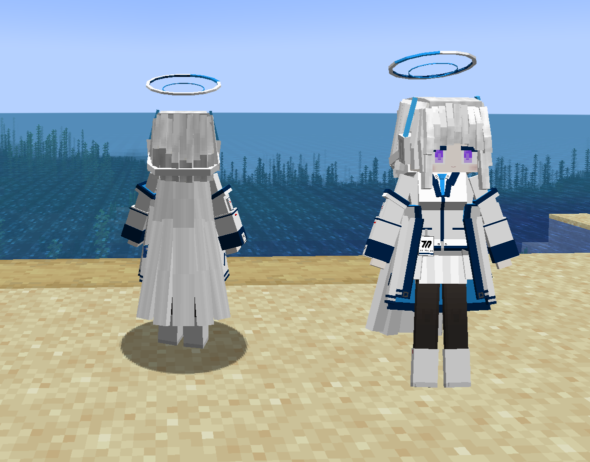

# BA_生盐诺亚_Ushio-Noa

## Model Info

Expand/Collapse

<!-- GENERATED MODEL PREVIEW README START -->

<!-- GENERATED MODEL PREVIEW README END -->

- **Name**: #生盐诺亚 | #Ushio-Noa
- **Category**: #Game
  - **Game**: #BA #Blue-Archive #碧蓝档案

## Download

Expand/Collapse

- [BA_生盐诺亚_Ushio-Noa.ysm (729.6 KB)](https://raw.githubusercontent.com/nekohalawrence/YSM-Model-Author/main/0147-%E6%B8%85%E6%99%A8%E7%9A%84%E4%B8%80%E9%98%B5%E9%A3%8E/BA_%E7%94%9F%E7%9B%90%E8%AF%BA%E4%BA%9A_Ushio-Noa/BA_%E7%94%9F%E7%9B%90%E8%AF%BA%E4%BA%9A_Ushio-Noa.ysm)

## Author Info

Expand/Collapse

## Author

- **Name**: #清晨的一阵风
  - **Author ID**: `0147`
  - **Role**: #模型 | #Model
  - **SocialPlatform**: #Bilibili
    - **Bilibili**: https://space.bilibili.com/510956578

## Co-creator

- **Name**: 生盐诺亚
  - **Role**: #精神支持！
  - **SocialPlatform**: #Bilibili
    - **Bilibili**: https://space.bilibili.com/510956578

