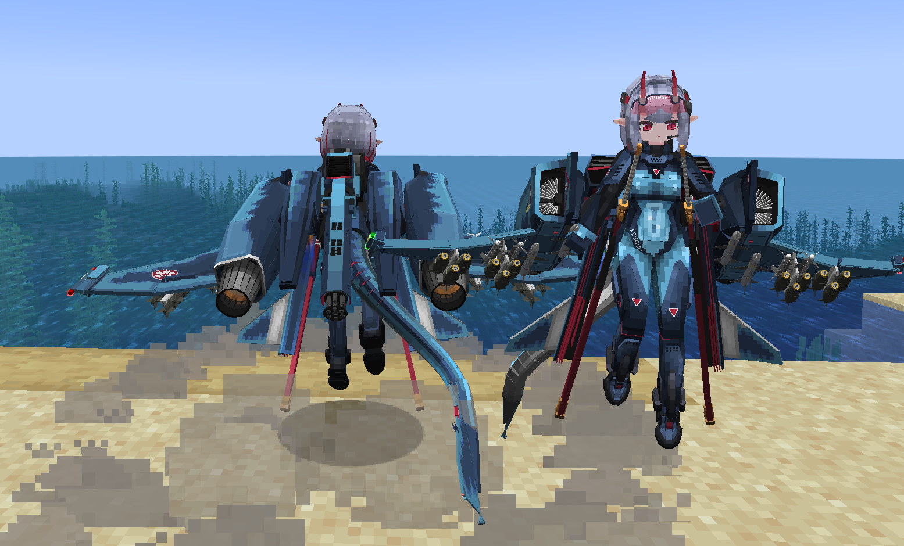
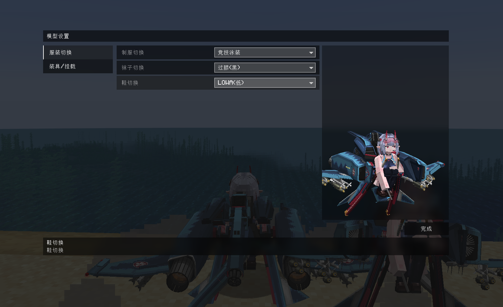
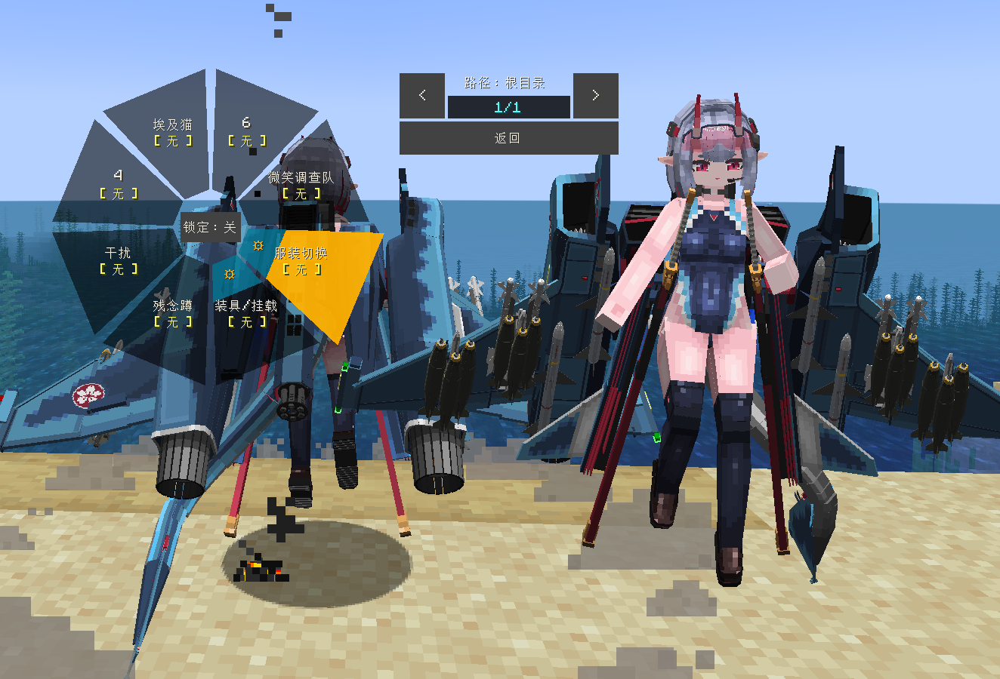

# F-4EJ_改

## Model Info

Expand/Collapse

<!-- GENERATED MODEL PREVIEW README START -->

<!-- GENERATED MODEL PREVIEW README END -->

- **Name**: 
- **Category**: #Unknown
  - **Game**: #Unknown

## Download

Expand/Collapse

- [F-4EJ_改.ysm (4.7 MB)](https://raw.githubusercontent.com/nekohalawrence/YSM-Model-Author/main/0154-%E9%93%B6%E6%B2%B3%E9%93%81%E9%81%93CRH2/F-4EJ_%E6%94%B9/F-4EJ_%E6%94%B9.ysm)

## Author Info

Expand/Collapse

## Author

- **Name**: #银河铁道CRH2
  - **Author ID**: `0154`
  - **Role**: #模型 #动作 #动画 | #Model #Motion #Animation
  - **SocialPlatform**: #Bilibili
    - **Bilibili**: https://space.bilibili.com/1605920
  - **SupportPlatform**: #Afdian
    - **Afdian**: https://afdian.com/a/CRH233

## Co-creator

- **Name**: 设定/模型：Snowenh

