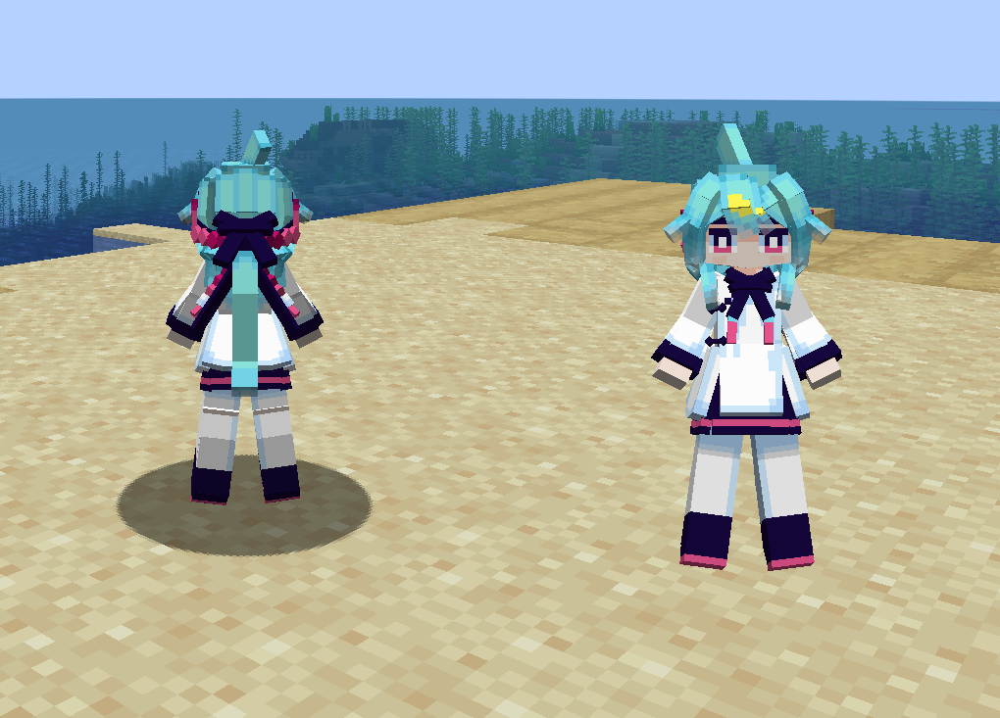

# OC_酱_TN

## Model Info

Expand/Collapse

<!-- GENERATED MODEL PREVIEW README START -->

<!-- GENERATED MODEL PREVIEW README END -->

- **Name**: 
- **Category**: #Original
  - **Game**: #OC #Original Character #原创角色

## Download

Expand/Collapse

- [OC_酱_TN.ysm (186.1 KB)](https://raw.githubusercontent.com/nekohalawrence/YSM-Model-Author/main/0158-%E5%85%94%E5%85%94%E7%8C%ABofficials%2C%E9%98%B4%E9%98%B3%E5%85%94%E5%85%94%E7%8C%ABoffcial/OC_%E9%85%B1_TN/OC_%E9%85%B1_TN.ysm)

## Author Info

Expand/Collapse

## Author

- **Name**: #兔兔猫officials | #阴阳兔兔猫offcial
  - **Author ID**: `0158`
  - **Role**: #全部（）
  - **SocialPlatform**: #Bilibili
    - **Bilibili**: https://space.bilibili.com/3546785165347464
  - **SupportPlatform**: #Afdian
    - **Afdian**: https://ifdian.net/a/RABET

## Co-creator

- **Name**: 支离破碎的TN酱
  - **Role**: #oc方
  - **SocialPlatform**: #Bilibili
    - **Bilibili**: https://space.bilibili.com/77479483

