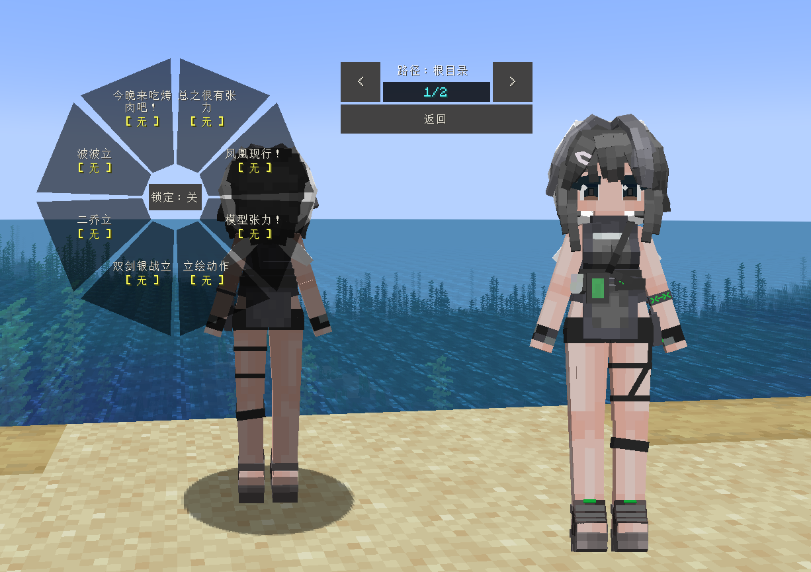

# AK_羽毛笔_LaPluma

## Model Info

Expand/Collapse

<!-- GENERATED MODEL PREVIEW README START -->

<!-- GENERATED MODEL PREVIEW README END -->

- **Name**: #羽毛笔 | #Lapluma
- **Category**: #Game
  - **Game**: #AK #Arknights #明日方舟

## Download

Expand/Collapse

- [AK_羽毛笔_LaPluma_v1.0.ysm (201.9 KB)](https://raw.githubusercontent.com/nekohalawrence/YSM-Model-Author/main/0161-%E5%A4%B1%E8%B8%AA%E7%9A%84%E6%9D%8E%E5%85%83/AK_%E7%BE%BD%E6%AF%9B%E7%AC%94_LaPluma/AK_%E7%BE%BD%E6%AF%9B%E7%AC%94_LaPluma_v1.0.ysm)

## Author Info

Expand/Collapse

## Author

- **Name**: #失踪的李元
  - **Author ID**: `0161`
  - **Role**: #模型 | #Model
  - **SocialPlatform**: #Bilibili
    - **Bilibili**: https://space.bilibili.com/505613984
  - **SupportPlatform**: #Afdian
    - **Afdian**: https://afdian.com/a/ly3064421540

