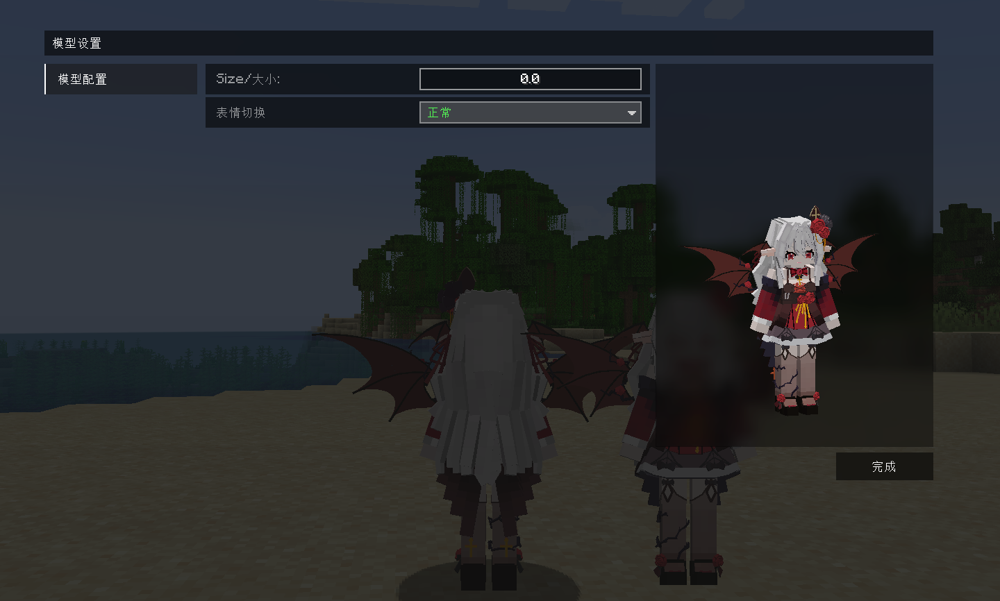

# VTuber_穆小泠Official_MuXiaoLing_LB

## Model Info

Expand/Collapse

<!-- GENERATED MODEL PREVIEW README START -->

<!-- GENERATED MODEL PREVIEW README END -->

- **Name**: #穆小泠Official | #MuXiaoLing
- **Category**: #Music
  - **Game**: #VTuber #Virtual YouTuber #虚拟主播

## Download

Expand/Collapse

- [VTuber_穆小泠Official_MuXiaoLing_v2.0.ysm (2.2 MB)](https://raw.githubusercontent.com/nekohalawrence/YSM-Model-Author/main/0164-%E9%BB%98%E6%A0%96%2C%E6%9F%90%E5%98%9E%E4%B8%AA%E9%BB%98%E6%A0%96%2C%E9%BB%98%E5%98%9E%E4%B8%AA%E6%9F%90%E6%A0%96/VTuber_%E7%A9%86%E5%B0%8F%E6%B3%A0Official_MuXiaoLing_LB/VTuber_%E7%A9%86%E5%B0%8F%E6%B3%A0Official_MuXiaoLing_v2.0.ysm)

## Author Info

Expand/Collapse

## Author

- **Name**: #默栖 | #某嘞个默栖 | #默嘞个某栖
  - **Author ID**: `0164`
  - **Role**: #模型 | #Model
  - **SocialPlatform**: #Bilibili
    - **Bilibili**: https://space.bilibili.com/477165698
  - **SupportPlatform**: #Afdian
    - **Afdian**: https://afdian.com/a/DLMoqi

## Co-creator

- **Name**: 穆小泠
  - **Role**: #原型人物
  - **SocialPlatform**: #Bilibili
    - **Bilibili**: https://space.bilibili.com/43272050

- **Name**: 瀛猫
  - **Role**: #动画 | #Animation
  - **SocialPlatform**: #Bilibili
    - **Bilibili**: https://space.bilibili.com/647224460
  - **SupportPlatform**: #Afdian
    - **Afdian**: https://afdian.cn/a/wincatpro

- **Name**: 烟雨画桥
  - **Role**: #动画 #武器 | #Animation
  - **SocialPlatform**: #Bilibili
    - **Bilibili**: https://space.bilibili.com/1268865161

