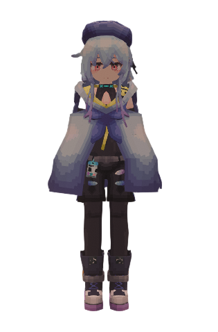
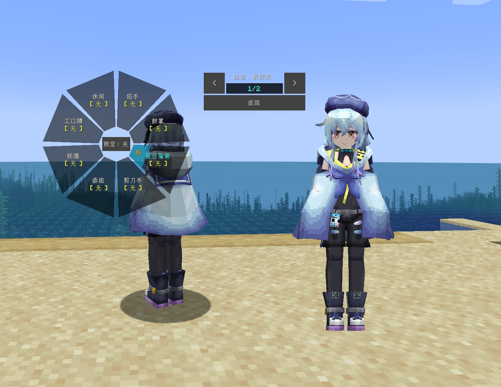
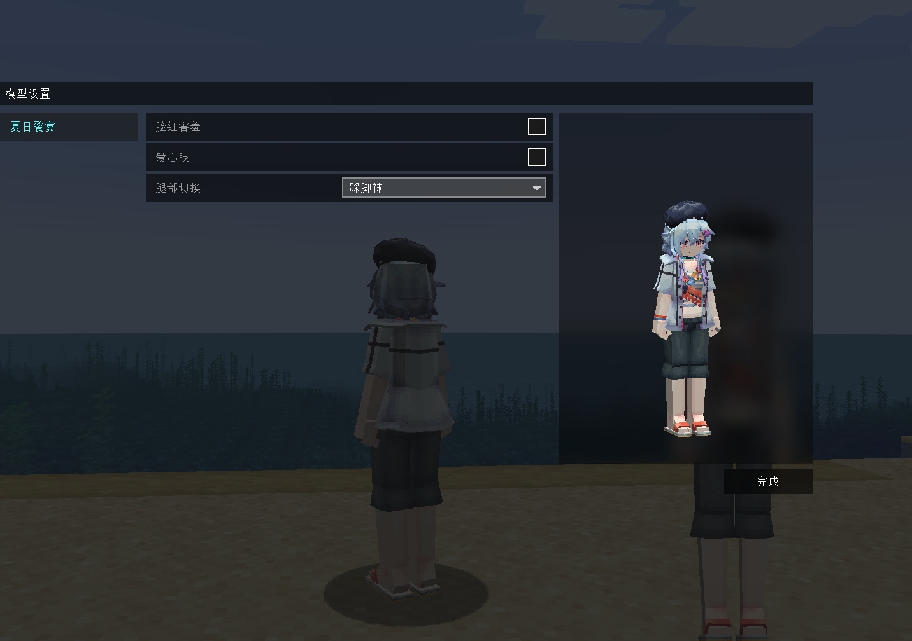
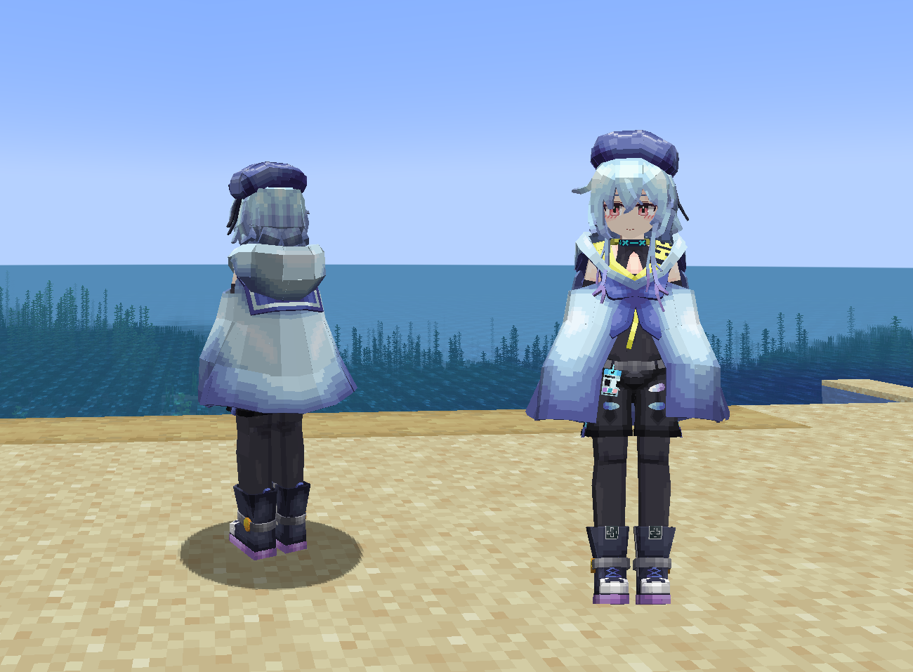
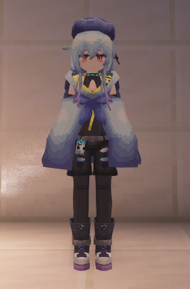

# AK_水月_Mizuki

## Model Info

Expand/Collapse

<!-- GENERATED MODEL PREVIEW README START -->

<!-- GENERATED MODEL PREVIEW README END -->

- **Name**: #水月 | #Mizuki
- **Category**: #Game
  - **Game**: #AK #Arknights #明日方舟

## Download

Expand/Collapse

- [AK_水月_Mizuki_v3.0.ysm (1.4 MB)](https://raw.githubusercontent.com/nekohalawrence/YSM-Model-Author/main/0183-MC-ZBM/AK_%E6%B0%B4%E6%9C%88_Mizuki/AK_%E6%B0%B4%E6%9C%88_Mizuki_v3.0.ysm)
- [AK_水月_Mizuki_v3.0_1.ysm (1.1 MB)](https://raw.githubusercontent.com/nekohalawrence/YSM-Model-Author/main/0183-MC-ZBM/AK_%E6%B0%B4%E6%9C%88_Mizuki/AK_%E6%B0%B4%E6%9C%88_Mizuki_v3.0_1.ysm)

## Author Info

Expand/Collapse

## Author

- **Name**: #MC-ZBM
  - **Author ID**: `0183`
  - **Role**: #模型 #动画 | #Model #Animation
  - **SocialPlatform**: #Bilibili
    - **Bilibili**: https://space.bilibili.com/604228173

